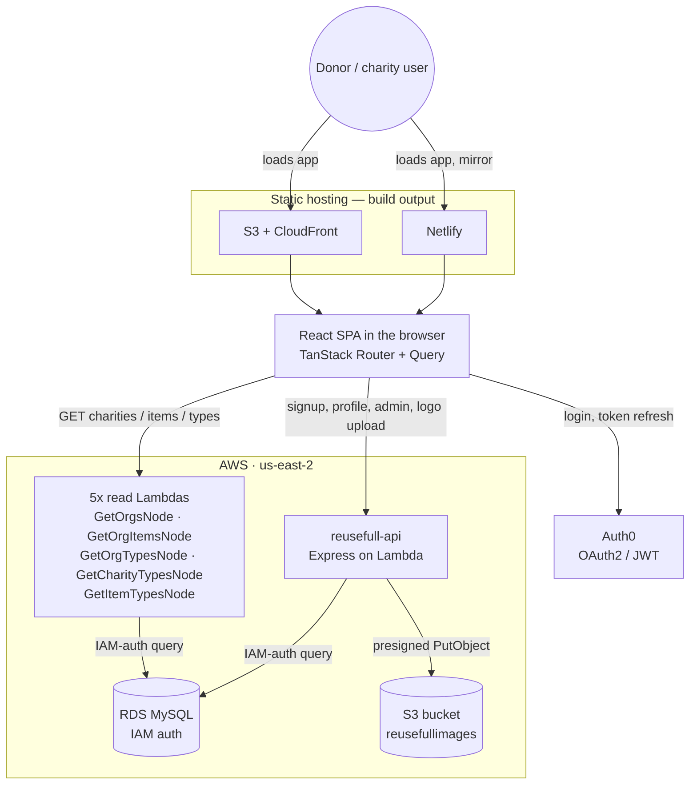

# Reusefull

Reusefull is a donation-matching site for the Kansas City area: donors describe what they want to give away, and the site shows which local charities accept those items — with pickup/drop-off, item-type, and category filters. Charities self-service their own listing (signup, logo, mission, accepted items) through an admin-approved profile.

Live site: [app.reusefull.org](https://app.reusefull.org) · Project board: [github.com/orgs/codeforkansascity/projects/1](https://github.com/orgs/codeforkansascity/projects/1) · License: MIT (Code for Kansas City)

## What it does

- **Donate flow** (`/donate` → `/donate/results`) — pick the items you're giving away, see matching charities.
- **Charity directory** (`/charitylist`, `/charity/:id`) — browse/filter all approved charities.
- **Charity signup** (`/charity/signup/step/1-3`) — a 3-step wizard (org info → mission/logo/categories → accepted items) that saves a draft after each step and submits for admin approval.
- **Charity profile self-service** (`/profile/edit`) — an approved charity's own user can edit their listing and swap their logo.
- **Admin console** (`/admin`, `/admin/charities/:id/edit`) — approve/deny pending charities, edit any charity's listing on their behalf.
- Auth (login, signup, email verification) via Auth0.

## Architecture



- **Frontend** — React 18 + TypeScript, TanStack Router (file-based, `src/routes/`) and TanStack Query, Tailwind CSS v4, Auth0 React SDK, Zustand for the signup wizard's draft state, React Hook Form.
- **`reusefull-api`** — an Express app wrapped with `serverless-http` and run on a Lambda Function URL. Handles everything that needs a database write or a JWT: charity signup/draft/submit, `/me`, admin approve/deny/edit, and presigned S3 uploads for charity logos. Full endpoint list: [reusefull-api/README.md](reusefull-api/README.md).
- **5 read-only Node Lambdas** (`Lambdas/*Node/`) — each is a single-purpose Lambda with its own Function URL (`GetOrgsNode`, `GetOrgItemsNode`, `GetOrgTypesNode`, `GetCharityTypesNode`, `GetItemTypesNode`) that the frontend queries directly for public list data (`src/api/queries/`). They connect to RDS with IAM auth as `reusefullrds` — no stored DB password.
- **`Lambdas/*`** (no `Node` suffix) — the original .NET 8 implementations of those same 5 read endpoints. They're being superseded by the Node versions but are still deployed; see [Deployment](#deployment).
- **Database** — RDS MySQL (`reusefull`, IAM-authenticated, no static credentials in any Lambda).
- More diagrams (data flow, React Query caching, route tree) live in [docs/ARCHITECTURE.md](docs/ARCHITECTURE.md).

## Repository layout

```
src/                     React frontend (routes, components, api queries, stores)
reusefull-api/           Express API, packaged and deployed to a Lambda Function URL
Lambdas/*Node/           5 read-only Node.js Lambdas (current)
Lambdas/<Name>/          5 read-only .NET 8 Lambdas (legacy, being replaced by the above)
docs/ARCHITECTURE.md     Deeper mermaid diagrams: data flow, caching, route tree
.github/workflows/       CI/CD — see Deployment below
Reusefull-react.sln      Visual Studio solution covering the .NET Lambda projects
```

## Local development

Prerequisites: Node 20+, npm. .NET 8 SDK only if you're touching the legacy Lambdas under `Lambdas/<Name>/`. An Auth0 application (SPA + API) if you want login to work locally.

### 1. Frontend

```bash
npm install
```

Create a `.env` in the repo root:

```ini
VITE_API_BASE_URL=http://localhost:3001
VITE_AUTH0_DOMAIN=your-tenant.us.auth0.com
VITE_AUTH0_CLIENT_ID=your_spa_client_id
VITE_AUTH0_AUDIENCE=https://reusefull-api
```

```bash
npm run dev
```

Runs at `http://localhost:5173`. Note the browse/donate/charity-list pages call the **deployed** read Lambdas directly (their URLs are hardcoded in `src/api/queries/*.ts`), so they show live data even without running anything else locally. Signup, profile editing, logo upload, and the admin console go through `VITE_API_BASE_URL`, so point that at a local `reusefull-api` (below) to exercise those flows.

### 2. Backend API (`reusefull-api`)

```bash
cd reusefull-api
npm install
```

Create `reusefull-api/.env`:

```ini
PORT=3001
AUTH0_DOMAIN=your-tenant.us.auth0.com
AUTH0_AUDIENCE=https://reusefull-api
DB_HOST=localhost
DB_PORT=3306
DB_NAME=reusefull
DB_USER=root
DB_PASSWORD=your_password
ACTION_SHARED_SECRET=change_me
CORS_ORIGIN=http://localhost:5173
AWS_REGION=us-east-2
S3_BUCKET=reusefullimages
```

(`AWS_REGION`/`S3_BUCKET` are only needed to exercise the logo-upload endpoint against the real bucket — that requires AWS credentials able to sign S3 uploads.)

```bash
npm run dev
# http://localhost:3001/health
```

### 3. Read-only Node Lambdas

These normally aren't run locally — see above, the frontend hits their deployed Function URLs directly. To test a change, either deploy to your own Lambda + point RDS access at it, or invoke `index.js`'s exported handler directly with a mocked event/context.

### 4. Legacy .NET Lambdas

Open `Reusefull-react.sln` in Visual Studio (.NET 8 SDK). Each project under `Lambdas/` can be run/debugged locally against RDS using the profile/role in its `aws-lambda-tools-defaults.json`.

## Deployment

| Piece | Trigger | Mechanism |
|---|---|---|
| Frontend (S3 + CloudFront) | Auto — push to **any branch** touching `src/**` or `index.html` | `.github/workflows/deploy-aws.yml` |
| Frontend (Netlify) | Auto — same trigger, runs in parallel | `.github/workflows/deploytonetlify.yml` |
| 5 Node Lambdas | Auto — push to `main` touching `Lambdas/<Name>Node/**` | `.github/workflows/deploy-get-*-node.yml` |
| `reusefull-api` | **Manual** — no workflow | see below |
| 5 legacy .NET Lambdas | **Manual** — no workflow | see below |

The frontend and the 5 Node Lambdas deploy themselves on push — nothing to do beyond merging. Two things worth knowing: the frontend workflows have no branch filter, so pushing to *any* branch that touches `src/**` redeploys production to both S3+CloudFront and Netlify; and the site currently has two live copies (S3+CloudFront and Netlify) from the same trigger.

### Deploying `reusefull-api`

Ships to the Lambda function **`react-reusefull`** (account `537766411402`, region `us-east-2`), which serves the Function URL used as `VITE_API_BASE_URL` in production.

```bash
cd reusefull-api
npm run package:lambda   # builds, installs prod deps into .lambda_pkg/, zips to lambda.zip
aws lambda update-function-code \
  --function-name react-reusefull \
  --zip-file fileb://lambda.zip \
  --region us-east-2 \
  --profile reuse-robkraft
```

On Windows, `package:lambda`'s `Compress-Archive` step can fail silently on a locked file inside `node_modules` and leave a truncated `lambda.zip` (a few KB instead of ~6-7MB) — check the size before uploading. If it happens, re-zip the already-built `.lambda_pkg` folder without rebuilding:

```powershell
Add-Type -AssemblyName System.IO.Compression.FileSystem
[System.IO.Compression.ZipFile]::CreateFromDirectory("$PWD\.lambda_pkg", "$PWD\lambda.zip", [System.IO.Compression.CompressionLevel]::Optimal, $false)
```

### Deploying the legacy .NET Lambdas

Each project (`Lambdas/GetOrgs`, `GetOrgItems`, `GetOrgTypes`, `GetCharityTypes`, `GetItemTypes`) deploys independently, target function name/role/profile read from its own `aws-lambda-tools-defaults.json` (profile `reuse-robkraft`, role `2024LambdasToCallRDS`, account `537766411402`). Either right-click the project in Visual Studio → **Publish to AWS Lambda**, or from the project folder:

```bash
dotnet lambda deploy-function
```

## License

MIT — see [LICENSE](LICENSE).
