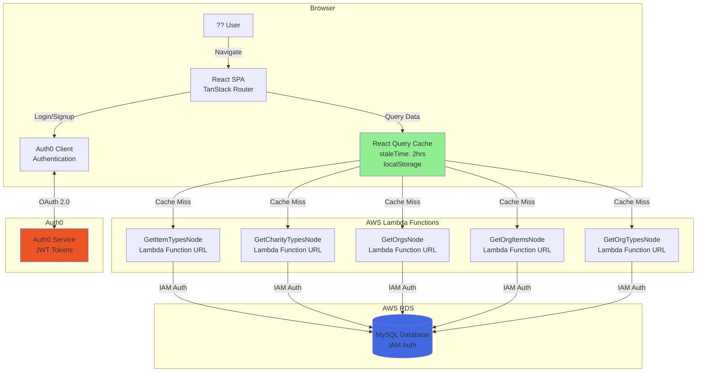
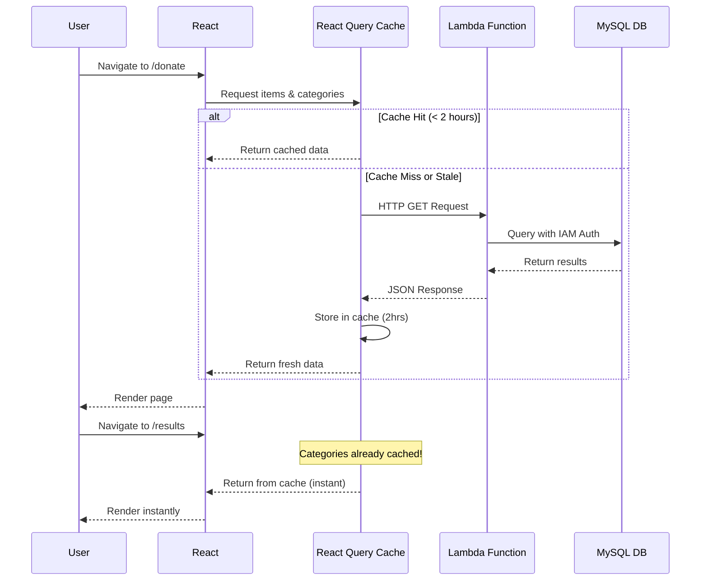
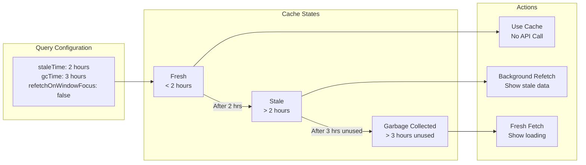
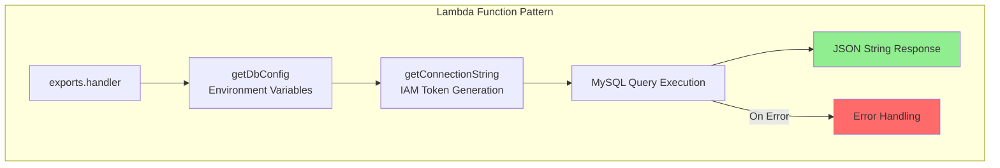

# Reusefull Application Architecture

## Overview
This document provides visual diagrams of the Reusefull application architecture, data flow, and caching strategy.

## High-Level Architecture



## Data Flow



## React Query Caching Strategy



## Application Routes

```mermaid
graph TD
    Root[__root.tsx<br/>Auth0 + React Query]
    
    Root --> Home[/index.tsx<br/>Home Page]
    Root --> Donate[/donate/index.tsx<br/>Donation Form]
    Root --> Results[/donate/results.tsx<br/>Results Page]
    Root --> Charity[/charity/$charityId.tsx<br/>Charity Detail]
    Root --> Admin[/admin/index.tsx<br/>Admin Panel]
    Root --> SignupStep1[/charity/signup/step/1.tsx]
    Root --> SignupStep2[/charity/signup/step/2.tsx]
    Root --> SignupStep3[/charity/signup/step/3.tsx]
    
    Donate -->|ensureQueryData| ItemsQuery[itemsQuery<br/>categoriesQuery]
    Results -->|ensureQueryData| OrgsQuery[orgsQuery<br/>orgItemsQuery]
    Charity -->|ensureQueryData| CharityQuery[orgsQuery<br/>orgCharityTypesQuery]
    
    style ItemsQuery fill:#FFE4B5
    style OrgsQuery fill:#FFE4B5
    style CharityQuery fill:#FFE4B5
```

## Lambda Function Structure



## Technology Stack

### Frontend
- **React** - UI framework
- **TanStack Router** - Client-side routing
- **React Query** - Data fetching & caching
- **Auth0** - Authentication
- **Tailwind CSS** - Styling

### Backend
- **AWS Lambda** - Serverless functions (Node.js)
- **Lambda Function URLs** - HTTP endpoints
- **AWS RDS** - MySQL database
- **IAM Authentication** - Secure database access

### Data Flow
1. User navigates to a route
2. Router loader calls `queryClient.ensureQueryData()`
3. React Query checks cache
4. If cache miss, calls Lambda Function URL
5. Lambda generates IAM auth token
6. Lambda queries MySQL with IAM auth
7. Response cached in localStorage for 2 hours
8. Future navigations use cached data

## Deployment

### CI/CD Pipeline
- **GitHub Actions** - Automated deployment
- **Lambda Node.js Functions** - Auto-deploy on push
- Workflow files in `.github/workflows/`

### Lambda Functions
- `GetItemTypesNode` - Fetches donation items
- `GetCharityTypesNode` - Fetches charity categories
- `GetOrgsNode` - Fetches organizations
- `GetOrgItemsNode` - Fetches org-item relationships
- `GetOrgTypesNode` - Fetches org-type relationships

## Security

### Authentication
- OAuth 2.0 via Auth0
- JWT tokens stored in localStorage
- Refresh tokens enabled

### Database Access
- IAM authentication (no passwords)
- RDS Signer generates temporary tokens
- SSL/TLS encrypted connections

### CORS
- Configured in Lambda functions
- Wildcard origin (`*`) for public APIs
